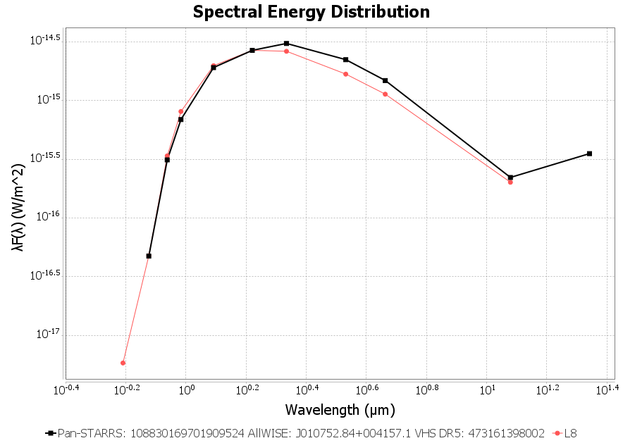

# AstroToolBox

AstroToolBox is a comprehensive Java suite designed for the visualization, identification, and classification of celestial bodies, particularly focusing on low-mass stars and ultra-cool dwarfs.

This toolkit integrates various astronomical catalogs including SIMBAD (all available measurements & references), AllWISE, CatWISE, unWISE, Gaia, NOIRLab Source Catalog (NSC), Pan-STARRS, SDSS, TESS Input Catalog, UKIRT UHS & UKIDSS, VISTA VHS, and 2MASS. Additionally, it provides a spectral type evaluation tool for main sequence stars, including brown dwarfs, utilizing established relations from Pecaut & Mamajek (2013), Best et al. (2018), Carnero Rosell et al. (2019), Skrzypek et al. (2015), Skrzypek et al. (2016), and Kiman et al. (2019).

For ultra-cool and white dwarfs, AstroToolBox offers an SED fitting tool using Best et al. SEDs for Field Ultracool Dwarfs and the Montreal Cooling Sequences (Bergeron et al.) for white dwarfs. Moreover, it includes a functionality to generate Gaia color-magnitude diagrams (CMD) with overlaid M0-M9 spectral types, along with the capability to plot Montreal Cooling Sequences on the white dwarf branch.

Users can generate WISE light curves from AllWISE Multiepoch and NEOWISE-R Single Exposure (L1b) photometry and save plots as PNG or PDF files. Furthermore, the toolkit facilitates image blinking from different epochs using WISE coadds (Meisner et al. 2017), DECaLS cutouts (Dey et al. 2019), and Pan-STARRS WARP images (Waters et al. 2020) to identify motion or variability of objects, with the option to save images as PNG or animated GIF files.

AstroToolBox allows overlaying of featured catalogs and creation of custom overlays from VizieR catalogs, ADQL queries or local files. Overlay shapes can be clicked to show catalog details. Another feature is the display of time series (static or animated) using infrared and optical images from various surveys (DSS, SDSS, 2MASS, WISE, Spitzer, UKIDSS, UHS, VHS, Pan-STARRS, DECaLS).

The toolkit incorporates a photometric classifier using data from the aforementioned catalogs to provide detailed spectral type classification. It also has an ADQL query interface for searching the ESAC, IRSA, NOIRLab and VizieR data archives.

Additionally, AstroToolBox offers a file browser linked to the image viewer for convenient checking of a large list of objects, allowing users to save interesting finds in an object collection for future reference. It also provides various astrometric calculators and converters for user convenience.

AstroToolBox can be cited via its ASCL.net entry 

[Download latest version](releases/executables/AstroToolBox-4.1.0.jar)

[Release notes](releases/release%20notes.md)

## Screenshots

[Catalog search](#catalog-search)  
[Image Viewer](#image-viewer)  
[Image Series](#image-series)  
[Photometric Classifier](#photometric-classifier)  
[VizieR Catalogs](#vizier-catalogs)  
[ADQL Query](#adql-query)  
[Batch Query](#batch-query)  
[File Browser](#file-browser)  
[Custom Overlays](#custom-overlays)  
[Calculators and Converters](#calculators-and-converters)  
[Photometric Relations](#photometric-relations)  
[SIMBAD Measurements and References](#simbad-measurements-and-references)  
[Object details](#object-details)  
[SED fitting](#sed-fitting)  
[Gaia CMD](#gaia-cmd)  
[Color-Color Diagram](#color-color-diagram)  
[WISE light curves](#wise-light-curves)  

### Catalog search

### Image Viewer

#### WISE image blinks plus AllWISE overlays (green circles)

#### Pan-STARRS WARP image blinks

#### Same binary in DECaLS, PS1 and WISE imagery

### Image Series

### Photometric Classifier

### VizieR Catalogs

### ADQL Query

### Batch Query

### File Browser

### Custom Overlays

### Calculators and Converters

### Photometric Relations

### SIMBAD Measurements and References

### Object details

### SED fitting

#### Ultra-cool dwarfs

#### White dwarfs

### Gaia CMD

#### Overplotted M0-M9 spectral types

#### Overplotted Montreal Cooling Sequences 

### Color-Color Diagram

#### J-W2 vs. W1-W2

### WISE light curves

#### AllWISE Multiepoch & NEOWISE-R Single Exposure photometry

