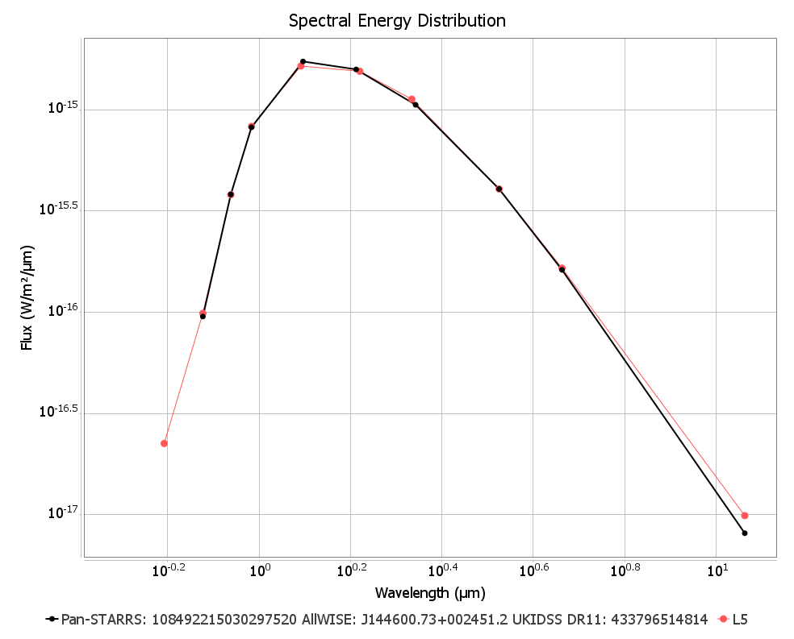

**AstroToolBox** is a Java tool set for the identification and classification of astronomical objects with a focus on low-mass stars and ultra-cool dwarfs. It contains a catalog search for SIMBAD (measurements & references), AllWISE, CatWISE, unWISE, Gaia, NOIRLab Source Catalog (NSC), Pan-STARRS, SDSS, TESS Input Catalog, VISTA VHS and 2MASS catalogs, plus a spectral type evaluation feature for main sequence stars including brown dwarfs. The spectral type evaluation is performed by applying the relations described in Pecaut & Mamajek (2013), Best et al. (2018), Carnero Rosell et al. (2019), Skrzypek et al. (2015), Skrzypek et al. (2016) and Kiman et al. (2019). There's an SED fitting tool for ultra-cool and white dwarfs using Best et al. SEDs for Field Ultracool Dwarfs and the Montreal Cooling Sequences (Bergeron et al.) for white dwarfs, respectively. A feature that enables the drawing of Gaia color-magnitude diagrams (CMD) with overplotted M0-M9 spectral types is also included. The Montreal Cooling Sequences can be drawn on the white dwarf branch of the Gaia CMD. The SEDs and CMDs can be saved as PNG or high quality PDF files. Furthermore, the tool has an image viewer that blinks images from different epochs, using WISE coadds (Meisner et al. 2017) and DECaLS cutouts (Dey et al. 2019), in order to visually identify the motion or variability of objects. These images can be saved as PNG or animated GIF files. Overlays of all featured catalogs can be added as needed. Custom overlays can be created from VizieR catalogs or local files. The tool displays time series (static or animated) using infrared and optical images of various surveys (DSS, SDSS, 2MASS, AllWISE, DECaLS). It contains a photometric classifier that uses the photometry of the above mentioned catalogs to create a detailed spectral type classification. The tool also includes an ADQL query interface (IRSA, VizieR, NOAO) and a batch spectral type lookup feature that uses a CSV file with object coordinates as input. In addition, the tool has a file browser linked to the image viewer, which makes it possible to check a large list of objects in a convenient way. Interesting finds can be saved in an object collection for later use. The tool also offers a number of handy astrometric calculators and converters.

[Download latest version](releases/executables/AstroToolBox-2.4.0.jar)

[Download Gaia CMD data](releases/resources/Gaia%20CMD%20data.zip)

[View release notes](releases/release%20notes.md)

## Screenshots

### Catalog search

### Image Viewer

#### WISEA J085510.74-071442.5: WISE coadds (epochs 2010 & 2014-2020) plus AllWISE overlays (green circles)

### Image Series

### Photometric Classifier

### ADQL Query

### Batch Query

### File Browser

### Custom Overlays

### Calculators & Converters

### SIMBAD Measurements & References

### SED fitting for low-mass and ultra-cool dwarfs

### SED fitting for white dwarfs

### SED fitting for white dwarfs with overplotted models

### Gaia CMD with overplotted M0-M9 spectral types

### Gaia CMD with overplotted Montreal Cooling Sequences 

