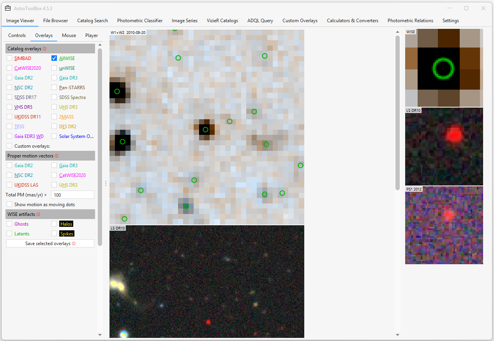
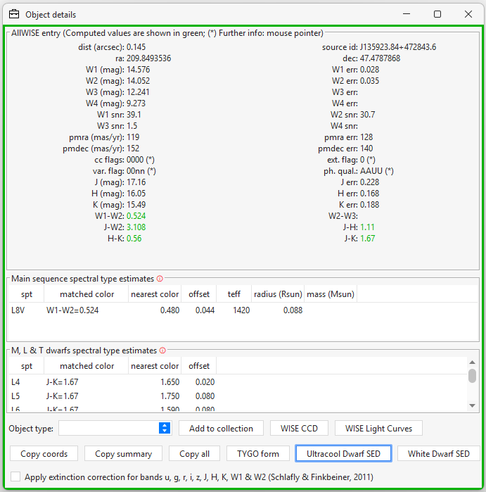
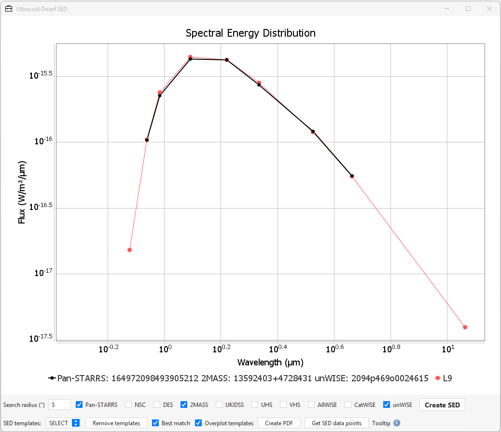

# Spectral Energy Distribution (SED) Fitter

## Overview

The **SED Fitter** is a tool designed to estimate the spectral type of ultracool dwarfs by comparing their observed broadband **Spectral Energy Distribution (SED)** with a library of template SEDs.

Unlike traditional χ² fitting approaches that require precise photometric uncertainties and are highly sensitive to individual outliers, AstroToolBox uses a **robust median-based fitting algorithm** that is specifically optimized for heterogeneous survey photometry and partially missing data.

The tool is particularly useful for:

* Photometric classification of ultracool dwarf candidates
* Rapid inspection of spectral energy distribution
* Identifying peculiar objects
* Detecting photometric inconsistencies

---

# Opening the SED Fitter

The SED fitter is available from the **Image Viewer**.

1. Open the **Image Viewer** and enable the desired catalog overlays in the **Overlays** panel on the left.
2. Click the overlay marker corresponding to the object you want to analyze.
3. The **Object Details** window will open.
4. Click the **Ultracool Dwarf SED** button.

The SED fitter will then query the selected photometric catalogs, retrieve the available photometry, and automatically generate the object's Spectral Energy Distribution (SED). Depending on the selected catalogs and your internet connection, this process may take a few seconds.









---

# User Interface

## SED Plot

The main panel displays:

* **X-axis:** Wavelength (μm)
* **Y-axis:** Flux F(λ) (W m⁻² μm⁻¹)

Both axes are displayed on a **logarithmic scale**.

The observed SED is shown as a **black curve** with circular markers.

Template SEDs are shown as colored curves.

---

# Mouse Interaction

## Tooltips

Moving the mouse over an observed data point displays:

* Catalog name
* Filter name
* Magnitude
* Effective wavelength
* Flux density F(ν)
* λF(λ)
* F(λ)

---

## Context Menu

Right-clicking on the plot opens the standard JFreeChart context menu, which allows:

* Saving the figure
* Printing the figure
* Copying the image

---

# Search Radius

```
Search radius (")
```

Specifies the search radius in arcseconds used when retrieving photometry from external catalogs.

Default value:

```
5 arcsec
```

The radius can be increased for:

* high proper motion objects,
* poorly constrained coordinates,
* manual investigations.

A larger radius increases the probability of retrieving an incorrect cross-match.

---

# Photometric Catalog Selection

The SED fitter can combine photometry from several surveys.

## Optical catalogs

Only one of the following can be selected:

* Pan-STARRS
* NSC (NOIRLab Source Catalog)
* DES

These surveys provide:

* g
* r
* i
* z
* y

bands.

---

## Near-infrared catalogs

Only one of the following can be selected:

* 2MASS
* UKIDSS
* UHS
* VHS

These surveys provide:

* J
* H
* K

bands.

---

## Mid-infrared catalogs

Only one of the following can be selected:

* AllWISE
* CatWISE
* unWISE

These surveys provide:

* W1
* W2
* W3 (AllWISE only)

bands.

---

# Automatic Catalog Fallback

If a selected catalog does not contain a counterpart, AstroToolBox automatically switches to an alternative survey.

Examples:

```
Pan-STARRS → NSC
2MASS      → UKIDSS → UHS → VHS
AllWISE    → CatWISE → unWISE
```

This behaviour ensures that an SED can often be generated even when the preferred catalog is unavailable.

---

# Buttons

## Create SED

Requeries all selected catalogs and rebuilds the SED.

Use this after:

* changing the search radius,
* selecting different catalogs,
* modifying the fitting options.

---

## Remove Templates

Removes all template SEDs from the plot and displays only the observed SED.

---

## Create PDF

Creates a PDF version of the current plot and opens it with the system PDF viewer.

---

## Get SED Data Points

Displays all plotted data points as:

```
(wavelength, flux)
```

pairs.

This is useful for:

* publication figures,
* external modelling,
* custom fitting procedures.

---

# Template Controls

## SED Templates Dropdown

The dropdown menu allows two modes:

### Automatic mode

```
SELECT
```

AstroToolBox automatically determines the best matching spectral type(s).

---

### Manual mode

Any spectral type can be selected manually.

The corresponding template SED is then displayed regardless of the automatic fit result.

This is useful for:

* visual comparison,
* investigating peculiar objects,
* comparing neighbouring spectral types.

---

## Best Match

When enabled:

* only the single best-fitting template is displayed.

When disabled:

* the three best-fitting templates are displayed.

This can be useful for estimating the uncertainty of the photometric classification.

---

## Overplot Templates

When enabled:

* templates are vertically shifted to match the brightness of the target.

When disabled:

* templates are plotted at their intrinsic absolute magnitudes.

This allows a direct visual comparison of luminosities.

---

# The Fitting Procedure

## Motivation

Brown dwarf photometry is often:

* incomplete,
* obtained from multiple surveys,
* affected by variability,
* contaminated by mismatches,
* affected by unresolved binaries.

A classical χ² fit can therefore be dominated by a few bad measurements.

The AstroToolBox SED fitter instead uses a **robust median-based approach**.

---

# Step 1 – Compare with Every Template

For each template spectral type:

```
Δm_i = m_obs,i − m_template,i
```

is computed for every band where both the target and the template contain valid photometry.

---

# Step 2 – Determine the Median Offset

The median of all magnitude differences is calculated:

```
Δm_med = median(Δm_i)
```

This value represents the global brightness difference between the target and the template.

Physically, it is equivalent to shifting the template vertically until it approximately overlaps the observed SED.

---

# Step 3 – Compute Residuals

For every band:

```
r_i = |Δm_i − Δm_med|
```

is calculated.

These residuals measure how well the *shape* of the observed SED agrees with the template, independent of the absolute brightness.

---

# Step 4 – Outlier Rejection

A band is considered consistent with the template if:

```
r_i < 0.3 mag
```

At most two bands are allowed to violate this criterion.

Templates with larger discrepancies are rejected.

---

# Step 5 – Quality Metric

For all remaining templates:

```
Q = mean(r_i)
```

is computed.

The template with the smallest value of:

```
Q
```

is considered the best-fitting spectral type.

---

# Minimum Photometric Requirement

At least:

```
4 valid photometric bands
```

must be available.

Objects with fewer measurements are not fitted automatically.

---

# Interpreting the Results

## Good Fit

Characteristics:

* smooth overlap of template and observations,
* small residuals,
* neighbouring templates have similar shapes.

Usually indicates a normal ultracool dwarf.

---

## Poor Fit

Large deviations may indicate:

* incorrect cross-match,
* bad photometry,
* unresolved binary,
* young object,
* subdwarf,
* unusual metallicity,
* reddening,
* extragalactic contaminant.

---

# Recommended Workflow

1. Generate the SED.
2. Inspect the automatically selected template.
3. Hover over suspicious data points.
4. Compare with neighbouring spectral types.
5. If necessary, disable problematic catalogs and regenerate the SED.
6. Save the figure or export the data points.

---

# Notes

The template library currently contains empirical ultracool dwarf SEDs covering M, L, and T spectral types. M0 to M5 templates are from Deacon et al. (2016), M6 to T9 templates are from Best et al. (2018).

The SED fitter is intended as a **photometric classification tool** and should not replace spectroscopic classification whenever spectroscopy is available.
